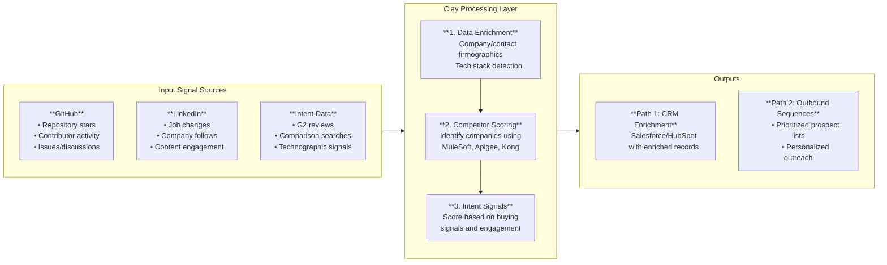

# WSO2 Competitor Displacement & Developer Targeting Engine

*Architecture diagram for competitor customer targeting - Created Feb 5, 2026*

## Components

### Input Signal Sources

| Source | Signals | Why It Matters |
|--------|---------|----------------|
| **GitHub** | Repo stars, contributors, issues | Identifies developers using competitor tools |
| **LinkedIn** | Job changes, follows, engagement | Tracks career moves and interest signals |
| **Intent Data** | G2 reviews, comparisons, technographics | Shows active evaluation and tech stack |

### Clay Processing Layer

1. **Data Enrichment** - Pull firmographics, contacts, tech stack from multiple providers
2. **Competitor Scoring** - Flag companies using MuleSoft, Apigee, Kong (WSO2 competitors)
3. **Intent Signals** - Score based on buying signals and engagement levels

### Outputs

- **CRM Enrichment** - Push enriched records to Salesforce/HubSpot
- **Outbound Sequences** - Generate prioritized lists for personalized outreach

## Figma Recreation Guide

**Layout:** Left-to-right flow, 3 columns

**Left Column - Input Sources:**
- GitHub (cyan/teal box with GitHub icon)
- LinkedIn (cyan/teal box with LinkedIn icon)
- Intent Data (cyan/teal box with chart icon)

**Center Column - Clay Processing:**
- Data Enrichment (purple box, step 1)
- Competitor Scoring (purple box, step 2)
- Intent Signals (purple box, step 3)
- Arrows connecting steps vertically

**Right Column - Outputs:**
- CRM Enrichment (orange/coral box)
- Outbound Sequences (orange/coral box)

**Styling:**
- Dark background (#1a1a2e)
- Rounded rectangles
- Color coding: Inputs (cyan), Processing (purple), Outputs (orange)

## Notes

- This is the proposed architecture from the Jan 28, 2026 discovery call
- WSO2 competitors: MuleSoft, Apigee, Kong
- Key differentiator: Developer community signals (GitHub activity)
